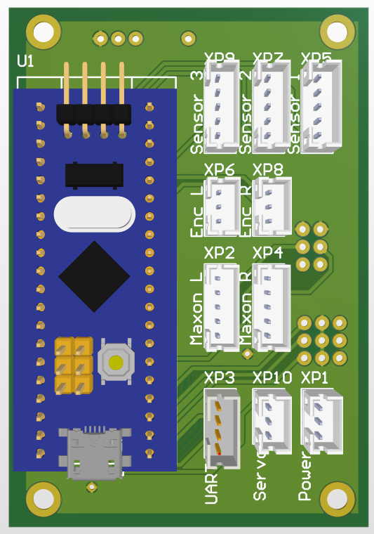

# Small Independent Mobile Actuator (SIMA) for Eurobot competition.

## Overview

This robot was developed for Eurobot competition for **RESET** team from **Skoltech Univercity**\
By **Ruslan Babakyan** - Chief Electronics Technician of the team in 2023 - 2024 \
Reset team has **won** Russian stage of the Eurobot competition with this robots


## Installation

1. Clone the repository:

   ```
   git clone https://github.com/RusBabakyan/Eurobot_SIMA.git
   ```

2. Navigate into the project directory:

   ```
   cd Eurobot_SIMA/Python API
   ```

3. Install the dependencies from `requirements.txt`:

   ```
   pip install -r requirements.txt
   ```

## Running the Project

To run the project, execute the following command in your terminal:

```
python Terminal.py
```

## Low level code
To upload low-level code to the board use CUBE IDE
Run SIMA_TEST_2.ioc from Eurobot_SIMA/SIMA_TEST_2

